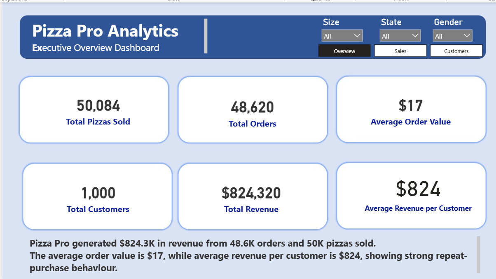
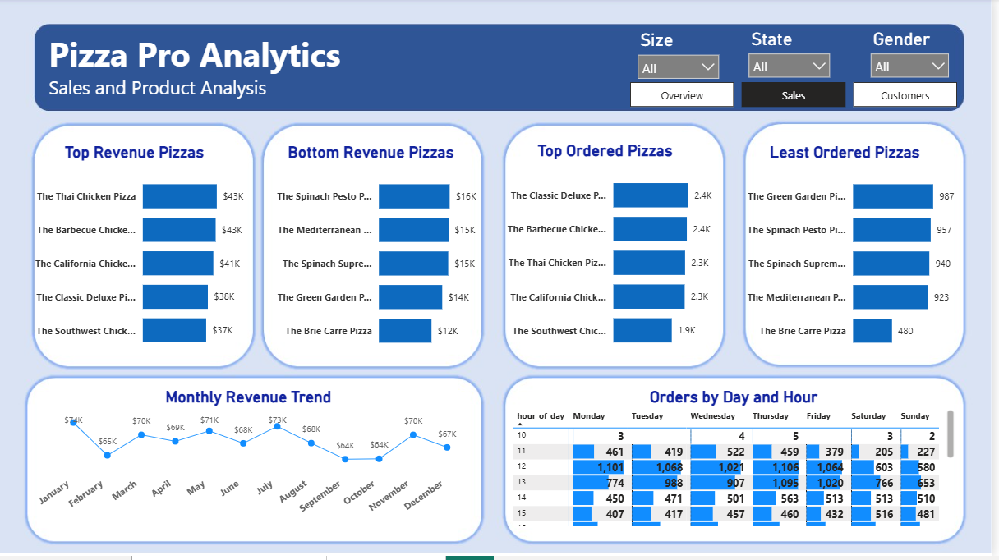
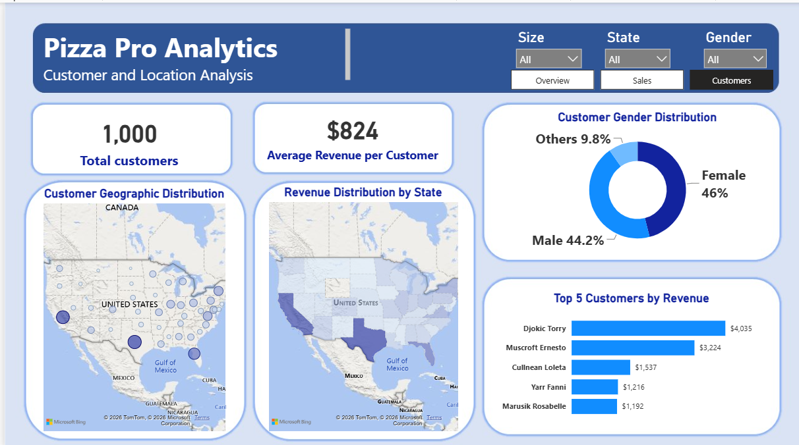

# Pizza Pro Analytics

## Project Overview

Pizza Pro Analytics is an end-to-end data analytics project focused on analysing pizza sales, product performance, customer behaviour, and location-based revenue patterns.

The project uses Power BI, DAX, Excel/Power Query, and SQL to transform raw pizza sales data into clear business insights and actionable recommendations. The final dashboard helps the business understand its revenue performance, best-selling products, underperforming pizzas, customer segments, peak order periods, and regional sales opportunities.

---

## Project Contents

- Power BI dashboard
- SQL business analysis queries
- Detailed business report
- Project presentation
- Dashboard screenshots

---

## Business Problem

Pizza Pro needed a clearer understanding of its sales and customer performance. The business wanted to answer key questions such as:

- Which pizzas generate the most revenue?
- Which pizzas are ordered the most and least?
- Which products are underperforming?
- What are the monthly sales trends?
- When do customers place the most orders?
- Which customers generate the highest revenue?
- Which locations have the strongest customer concentration?
- What actions can improve sales, customer retention, and operational planning?

---

## Tools Used

| Tool | Purpose |
|---|---|
| Power BI | Dashboard design, data modelling, DAX measures, visual analysis |
| Excel / Power Query | Data cleaning and transformation |
| SQL | Business analysis queries and KPI validation |
| DAX | KPI calculations and analytical measures |
| PowerPoint | Project presentation and storytelling |
| Word/PDF | Detailed business report documentation |

---

## Dataset Summary

The dataset contains pizza sales records, customer information, product details, and location-based data.

Key fields used in the analysis include:

- Order ID
- Customer ID
- Pizza ID
- Pizza name
- Quantity
- Pizza price
- Order price
- Order date
- Hour of day
- Customer gender
- Customer location/state

---

## Key KPIs

| KPI | Value |
|---|---:|
| Total Revenue | $824,320 |
| Total Orders | 48,620 |
| Total Pizzas Sold | 50,084 |
| Total Customers | 1,000 |
| Average Order Value | $17 |
| Average Revenue per Customer | $824 |

---

## Dashboard Pages

The Power BI dashboard contains three main pages:

### 1. Executive Overview

This page provides a high-level summary of overall business performance, including revenue, orders, pizzas sold, customer count, average order value, and average revenue per customer.

### 2. Sales and Product Analysis

This page focuses on product performance. It identifies the top revenue pizzas, bottom revenue pizzas, most ordered pizzas, least ordered pizzas, monthly revenue trends, and order distribution by day and hour.

### 3. Customer and Location Analysis

This page analyses customer behaviour and location patterns. It includes customer gender distribution, top customers by revenue, customer geographic distribution, and revenue distribution by state.

---

## Dashboard Screenshots

### Executive Overview



### Sales and Product Analysis



### Customer and Location Analysis



---

## Key Insights

### Overall Performance

Pizza Pro generated **$824,320 in total revenue** from **48,620 orders** and **50,024 pizzas sold**. The average order value is approximately **$17**, suggesting an opportunity to increase basket size through bundles, add-ons, and meal deals.

### Product Performance

The highest revenue-generating pizzas were:

- The Thai Chicken Pizza - $43K
- The Barbecue Chicken Pizza - $43K
- The California Chicken Pizza - $41K
- The Classic Deluxe Pizza - $38K
- The Southwest Chicken Pizza - $37K

Chicken-based pizzas dominate the top revenue list, showing strong customer preference and high financial value.

### Underperforming Products

The lowest revenue-generating pizzas included:

- The Brie Carre Pizza - $12K
- The Green Garden Pizza - $14K
- The Spinach Supreme Pizza - $15K
- The Mediterranean Pizza - $15K
- The Spinach Pesto Pizza - $16K

These products may require review, repositioning, promotional support, or possible replacement.

### Customer Insights

Pizza Pro has **1,000 customers**, with a balanced gender distribution:

- Female: 46%
- Male: 44.2%
- Others/Unknown: 9.8%

The top customers each generated over **$1,100**, creating opportunities for loyalty rewards, VIP offers, and personalised campaigns.

### Location Insights

Customer concentration is strongest on the **East Coast of the United States**, especially around the Northeast and Mid-Atlantic regions. There are also notable customer clusters in the Midwest and California, while the Central and Mountain West regions show lower customer density.

---

## Business Recommendations

### 1. Optimise the Pizza Portfolio

Pizza Pro should promote high-performing pizzas, especially Thai Chicken, Barbecue Chicken, and California Chicken pizzas. These should be featured in campaigns, bundle deals, and menu highlights.

Low-performing pizzas such as Brie Carre, Green Garden, Spinach Pesto, Spinach Supreme, and Mediterranean should be reviewed to determine whether they need recipe changes, pricing adjustments, better promotion, or removal from the menu.

### 2. Increase Average Order Value

The current average order value is approximately **$17**. Pizza Pro can increase revenue by introducing:

- Pizza and drink combos
- Family meal deals
- Buy-two-pizzas offers
- Add-on promotions
- Weekend bundle deals

### 3. Improve Customer Retention

Pizza Pro should introduce a loyalty programme for repeat customers and create a VIP segment for high-value customers who spend over $1,000.

Possible loyalty benefits include discounts, free delivery, exclusive offers, and early access to new menu items.

### 4. Use Location-Based Marketing

The business should focus retention campaigns on high-density customer regions such as the East Coast, while using awareness promotions and introductory discounts in lower-density regions.

### 5. Improve Peak-Time Operations

Order activity is strongest around lunch hours and selected weekend periods. Pizza Pro should align staffing, ingredient preparation, and delivery capacity with peak demand times.

---

## SQL Analysis

The SQL file contains queries used to validate KPIs and analyse business performance.

SQL queries include:

- Total revenue
- Total orders
- Total pizzas sold
- Average order value
- Top revenue pizzas
- Bottom revenue pizzas
- Most ordered pizzas
- Least ordered pizzas
- Monthly revenue trend
- Orders by day and hour
- Top customers by revenue

SQL file location:

```text
SQL/pizza_analysis_queries.sql